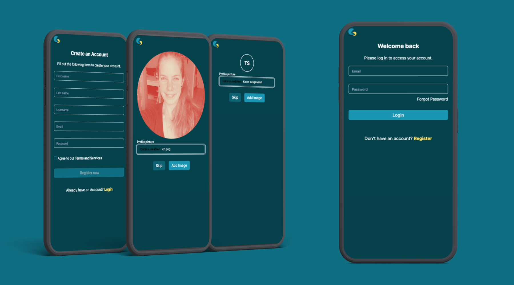
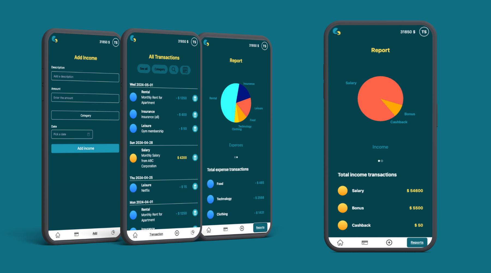
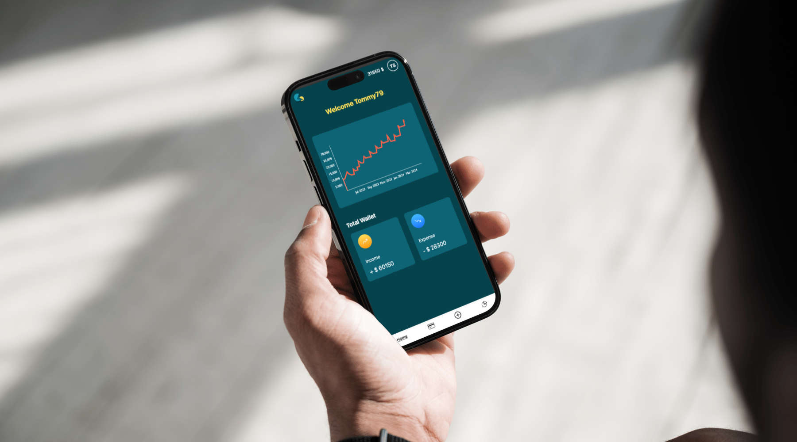

## Fullstack final project: 

# 💵 Finco - your finances at a glance

Finco is a web app for everyone, who wants to track their finances easily. Save your income and expenses and see how your finances develop over time. Not sure how much you spend on food on average? No problem, just take a look in your Finco app.

With its intuitive interface and powerful features, Finco is your go-to solution for managing your finances effectively. Start using Finco today and take control of your financial future.

## Deployment

https://finco-frontend.onrender.com/

**Or use it yourself**

To get started with Finco, follow these steps:

1. Clone the project repository from GitHub.
2. Install the necessary dependencies using 'npm i'.
3. Set up your MongoDB database.
4. Start the backend server using 'npm run dev'.
5. Start the frontend development server using 'npm run dev'.
6. Access Finco in your web browser at the specified URL.

## Authentication

Finco provides secure authentication features, allowing users to login or register for an account. Protect your financial data with robust authentication mechanisms.

## Mockups

 

 

## Tech Stack

| **Tools**     | **Client**    | **Server**    |
|---------------|---------------|---------------|
| VS Code       | JavaScript    | Node.js       |
| Trello        | HTML          | Express.js    |                                                   
| Discord       | CSS           | MongoDB       |
| Canva         | React.js      | Cloudinary    |
| Mailtrap      | Vite          | Cors          |
| Figma         | Tailwind      | Dotenv        |
|               | Shadcn        | JWT           |
|               | Victory       | Bcyrpt        |
|               |               | Cookie-parser |
|               |               | Multer        |
|               |               | NodeMailer    |

## Logo

Logo.png

 Logo.gif

## Authors

- [@JohannaHaer](https://github.com/JohannaHaer)
- [@VictordelaM](https://github.com/VictordelaM)
- [@Bwalyaa](https://github.com/Bwalyaa)
- [@Kaiznkinkaide](https://github.com/Kaiznkinkaide)

## Context

This web app was created as the final project of a fullstack web development bootcamp at [supercode GmBH & Co. KG](https://www.super-code.de/).